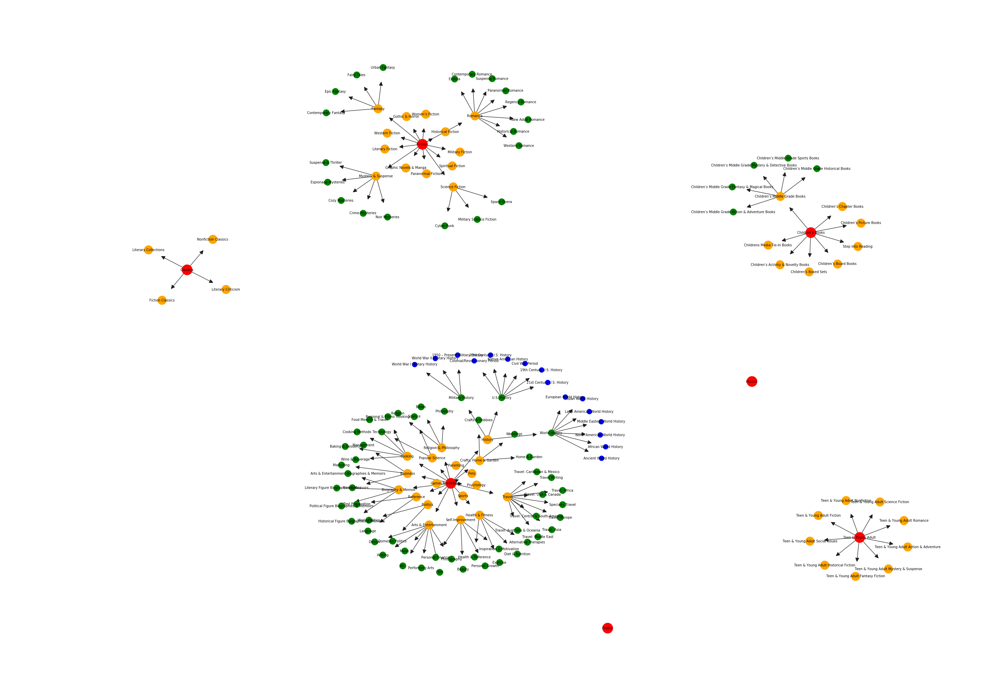

# BertSentenceClassification
Protoype Model to be used for the IDOML pipeline testing

## Task
The goal of the porject is to create a pipeline that classifies short text input into a hierarchical structure. The pipeline itself will be a prototype to showcase the IDOML platform to industrial partners. Therefore, we will a simplistic approach of training a BERT classifier at every depth of the label structure i.e. the first classifier will be trained only on the high level labels and the following ones will be trained only on the more detailed labels. More intricate architecures might follow. 

## Dataset
The dataset to be used is the Blurb Genre Collection. It contains 91,892 short descriptions found on the back of books (blurbs) of an average length of 157.51 as well as the associated labels. The labels are hierarchical i.e. the first label determines the overall genre of the book such as science fiction while the following labels conists of more specific genres of the book such as dark science fiction. On average, every blurb has 3.01 labels of the 146 possible genres. More information here: https://www.inf.uni-hamburg.de/en/inst/ab/lt/resources/data/blurb-genre-collection.html

## Model
As a base model we will use a pretrained BERT sentence classifier. We will append one hidden layer to the architecure and explicitly train it on the dataset to perform the classification. For the pretrained model, we will use HuggingFace. The ML library used is PyTorch. 

